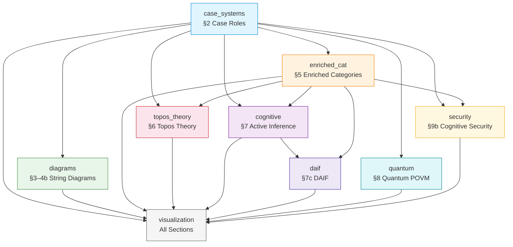
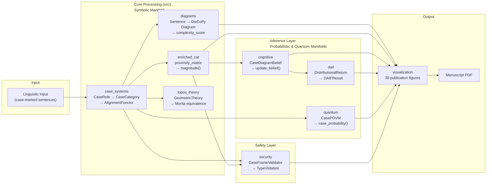
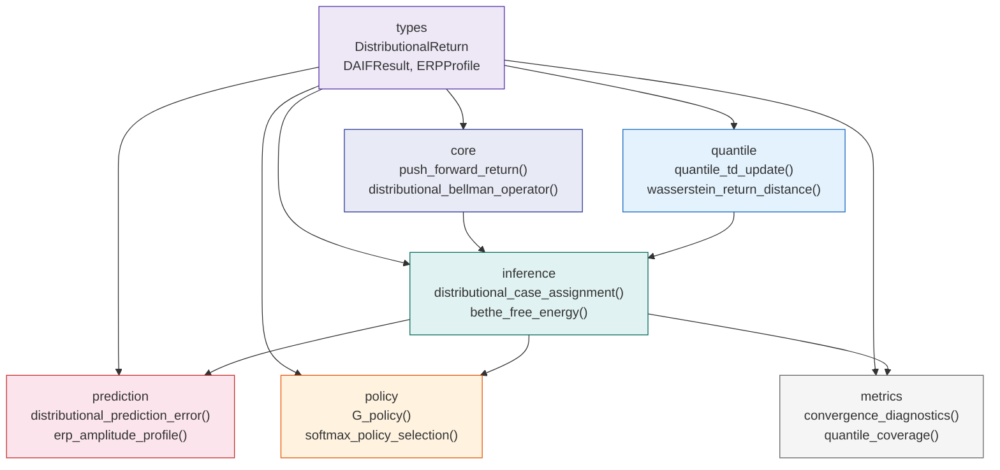

# Architecture Overview

High-level architecture of the `cognitive_case_diagrams` project: package dependencies, data flow, and design principles.

> For API-level detail, see [`api_reference.md`](api_reference.md).  
> For extending the architecture, see [`extension_guide.md`](extension_guide.md).

---

## Manuscript metrics (build helper)

[`src/generate_manuscript_metrics.py`](../src/generate_manuscript_metrics.py) is a standalone metrics collector (not imported by the nine domain packages). It feeds `output/metrics.json` used when rendering manuscript placeholders for test inventory counts. Same commands as in [`api_reference.md`](api_reference.md#manuscript-metrics-helper-srcgenerate_manuscript_metrics).

---

## Package Dependency Graph

The nine `src/` packages form a directed acyclic graph of imports. `case_systems` is the leaf dependency; `visualization` depends on everything.



### Dependency Rules

| Package | May import from | Must NOT import from |
|---------|----------------|---------------------|
| `case_systems` | *(no internal deps)* | anything in `src/` |
| `diagrams` | `case_systems` | `cognitive`, `daif`, `quantum`, `security` |
| `enriched_cat` | `case_systems` | `diagrams`, `cognitive`, `quantum` |
| `topos_theory` | `case_systems`, `enriched_cat` | `diagrams`, `cognitive`, `daif`, `quantum`, `security` |
| `cognitive` | `case_systems`, `enriched_cat` | `diagrams`, `quantum`, `security` |
| `daif` | `cognitive`, `enriched_cat`, `case_systems` | `diagrams`, `quantum`, `security` |
| `quantum` | `case_systems` | anything else except `case_systems` |
| `security` | `case_systems`, `enriched_cat` | `cognitive`, `quantum`, `diagrams` |
| `visualization` | **all packages** | *(unrestricted — it renders everything)* |

---

## Data Flow: From Linguistic Input to Publication Output

The pipeline transitions linguistic data through three rigidly structured analytical manifolds: the symbolic, the stochastic, and the quantum. The isolation between these strata is enforced strictly by Python type boundaries and explicit parameter spaces.



### Analytical Manifolds & Isolation Boundaries

The isolation layers prevent non-linear interference between the distinct semantic interpretations of case structure:

1. **Symbolic Manifold**: Handles invariant algebraic topologies. `diagrams` acts strictly on discrete variables ($N_C \in \mathbb{N}$ cups and boxes), outputting deterministic adjacency graphs.
2. **Probabilistic Manifold**: Encompasses `cognitive` and `daif`. The transition from symbolic to probabilistic assumes Bayesian exchangeability, translating rigid types into probability simplices ($\sum P(x) = 1$) and mapping prediction errors into the $L^1$-Wasserstein margin.
3. **Quantum Manifold**: Handled exclusively by `quantum/`. Case systems transit through POVMs over density matrices built by `semantic_state()`: `crisp_case_povm()` supplies rank-1 projective effects, `graded_case_povm()` and `fluid_s_povm()` supply context-rotated graded effects, `CasePOVM.is_complete()` checks the normalization $\sum_c E_c = I$, and `case_probability()` returns $P(c\mid\rho) = \mathrm{Tr}(E_c \rho)$. This keeps the layer algebraically equivalent to bounded state operators.

> **Not implemented.** Symmetric informationally complete POVMs (SIC-POVMs) and Weyl-Heisenberg displacement operators appear nowhere in `src/`. They are a prospective extension only — see the recipe in [`extension_guide.md`](extension_guide.md).

---

## Manuscript ↔ Code Alignment

The `src/` package structure mirrors the manuscript's chapter structure. Every equation label in the manuscript corresponds to a Python function.

| Manuscript §      | Package          | Key Equation → Function |
|-------------------|------------------|-------------------------|
| §2 Case Systems   | `case_systems/`  | `eq-2-1` → `CaseCategory.compose()` |
| §3 Grammar        | `diagrams/`      | `eq-discocat-type` → `Sentence` / `create_word_diagram_transitive()` |
| §4 DisCoCat        | `diagrams/`      | `eq-4-2` → compositional diagrams / `render_discopy_transitive()` |
| §4b Compact closure | `diagrams/`      | `eq-4-3` (snake), `eq-4-4` → `render_discopy_snake()`, `syntactic_complexity_score()` |
| §4c DisCoCirc      | `diagrams/`      | discourse → `Discourse`, `render_discopy_discocirc_discourse()` |
| §5 Enriched        | `enriched_cat/`  | `eq-5-3` (magnitude) → `EnrichedCategory.magnitude()` |
| §6 Topos           | `topos_theory/`  | `eq-6-1` → `check_morita_equivalence()` |
| §7 Active Inf.    | `cognitive/`     | `eq-free-energy` → `variational_free_energy()` |
| §7c DAIF           | `daif/`          | `eq-7-1` → `push_forward_return()` |
| §8 Quantum         | `quantum/`       | `eq-8-1` → `case_probability()` |
| §9b Security       | `security/`      | violations → `detect_type_violation()` |

> **Rule**: When adding a new equation to the manuscript, implement the corresponding function *first*, then add the equation label. This ensures every formula is computationally verified.

### DAIF Internal Module Architecture

The `src/daif/` subpackage (7 modules, 25 public symbols) has its own internal data-flow:



**Cognitive → DAIF handoff**: `src/cognitive/` produces `CaseDiagramBelief` objects (scalar probability vectors). When the DAIF layer receives these, it enriches them into full `DistributionalReturn` objects via `push_forward_return()`, adding quantile representations, credible intervals, and return variance. The key boundary type is `CaseDiagramBelief` — shared by both packages via `src/cognitive/belief.py`.

| Configurable Parameter | Module | Default | Effect |
|----------------------|--------|---------|--------|
| `n_quantiles` | `core`, `inference` | 51 | Quantile resolution (more = higher fidelity, slower) |
| `gamma` | `core`, `policy` | 0.99 | Discount factor for future returns |
| `kappa` | `quantile` | 1.0 | Huber loss threshold (0 = pure quantile, ∞ = MSE) |
| `risk_distortion` | `quantile` | `"neutral"` | Risk attitude: `neutral`, `optimistic`, `pessimistic`, `CVaR` |
| `n_iterations` | `inference` | 10 | DAIF convergence iterations |
| `convergence_threshold` | `inference` | 1e-6 | Early stopping criterion |
| `temperature` | `policy` | 1.0 | Boltzmann exploration temperature |

---

## Design Principles

### 1. Manuscript-Aligned Package Structure (ADR-001)

Each `src/` subpackage maps directly to a manuscript section. This alignment makes it trivial to trace any equation or formalism to its implementation — and vice versa.

### 2. Zero-Mock Test Policy (ADR-002)

All project tests use real mathematical objects. `MagicMock`, `patch`, and all mocking frameworks are absolutely prohibited. Tests validate actual computational behavior on real numpy arrays and dataclass instances.

### 3. Visualization Accessibility (ADR-003)

All figure fonts must meet the 16pt floor (`FONT_SIZE_FLOOR = 16`). Figures export at `FIGURE_DPI = 300` with `DEFAULT_FIGSIZE = (10, 8)` — both defined in `src/visualization/styles.py`, which is the value of record. Colorblind-safe palettes are preferred.

### 4. Thin Orchestrator Pattern

Scripts in `scripts/` are thin orchestrators that import from `src/` and `infrastructure/`. They handle I/O and rendering only — **no scientific logic**. Putting computation in scripts breaks the architecture.

### 5. Dataclass-First Domain Model

All domain objects (`CaseRole`, `Morphism`, `CaseDiagramBelief`, `DistributionalReturn`, etc.) use `@dataclass`. Validation lives in `__post_init__`. Immutable objects use `frozen=True`.

### 6. Structured Logging

Every module uses `logging.getLogger(__name__)`. Operational events use `logger.info()`; mathematical derivation steps use `logger.debug()`. No `print()` statements.

---

## Layer Architecture

The project follows the template's Two-Layer Architecture:

| Layer | Location | Purpose |
|-------|----------|---------|
| **Layer 1** (Infrastructure) | `infrastructure/` (template monorepo root) | Generic build/validation tools shared across all projects |
| **Layer 2** (Project Logic) | `projects/ongoing/ActiveInference/cognitive_case_diagrams/src/` | All domain-specific scientific computation |
| **Orchestration** | `scripts/pipeline/` (template monorepo root) + this project's `scripts/` | Pipeline stages and figure generation |

### Pipeline Stages

The stage inventory is owned by the engine, not by this document: each stage is one `scripts/pipeline/stage_*.py` orchestrator at the template monorepo root, and the count is whatever that directory holds. The stages this project exercises are:

1. **`stage_00_setup.py`** — Verify Python version, dependencies, and build tools
2. **`stage_01_test.py`** — Run the infrastructure suite (≥60% coverage) then this project's `tests/` suite (≥90% line coverage on `src/`; counts via `pytest --collect-only`)
3. **`stage_02_analysis.py`** — Discover and run this project's `scripts/*.py` (figure generation; authoritative figure count in `output/metrics.json::total_figures`)
4. **`stage_03_render.py`** — Pandoc → LaTeX → PDF (plus web and slides formats when enabled)
5. **`stage_04_validate.py`** — Validate the generated PDFs, markdown formatting, and file integrity
6. **`stage_05_copy.py`** — Copy this project's `output/` tree up to the template monorepo root `output/`

Later stages (LLM review, executive report, provenance, ebook, metadata, and the rest) are optional engine extras; consult `scripts/pipeline/` in the template monorepo for the live list rather than a number recorded here.

---

## Test Architecture

All 64 test files (authoritative live count in `output/metrics.json::total_test_files`) follow the `test_{package}_{module}.py` naming convention. The tree below is a representative selection, not the full inventory — `tests/AGENTS.md` carries that:

```text
tests/
├── test_case_systems_case_category.py     # §2: CaseRole, CaseCategory, compose
├── test_case_systems_fluid_s.py           # §2: FluidSFunctor, volition
├── test_case_systems_functor.py           # §2: AlignmentFunctor, functoriality
├── test_case_systems_natural_transformation.py  # §2: Naturality verification
├── test_cognitive_belief.py               # §7: CaseDiagramBelief
├── test_cognitive_free_energy.py           # §7: KL, variational FE
├── test_cognitive_belief_updating.py       # §7: Bayesian update, sequential
├── test_cognitive_prediction_error.py      # §7: PE, P600 ratio
├── test_cognitive_action_selection.py      # §7: Expected free energy
├── test_cognitive_reanalysis.py           # §7: Magnitude reanalysis, N400
├── test_cognitive_integration.py          # §7: Cross-module integration
├── test_daif_types.py                     # §7c: ReturnDistribution, Agent
├── test_daif_core.py                      # §7c: Distributional Bellman
├── test_daif_inference.py                 # §7c: VMP, Bethe free energy
├── test_daif_metrics.py                   # §7c: Wasserstein, calibration
├── test_daif_policy.py                    # §7c: G-policy, EFE
├── test_daif_prediction.py                # §7c: DPE, N400/P600 mapping
├── test_daif_quantile.py                  # §7c: IQN, Huber quantile loss
├── test_diagrams_string_diagram.py        # §3: DisCoPy pregroup sentences
├── test_diagrams_complexity_metrics.py     # §4: Diagram complexity scoring
├── test_diagrams_ditransitive.py          # §4: Three-argument constructions
├── test_diagrams_complexity_examples.py    # §4: Example sentence constructions
├── test_diagrams_generator.py             # Script-level integration
├── test_enriched_cat_enriched.py          # §5: [0,1]-enrichment, magnitude
├── test_topos_theory_topos.py             # §6: GeometricTheory, Morita equiv
├── test_quantum_quantum_case.py           # §8: POVM, case_probability
├── test_security_cognitive_security.py    # §9b: TypeViolation, injection
├── test_visualization_*.py (16 files)     # All visualization modules
├── test_cross_module_coverage.py          # Edge case coverage
└── conftest.py                            # Shared fixtures + matplotlib Agg
```

**Total**: see `uv run pytest tests/ --collect-only -q`. Coverage: ≥90% line coverage on `src/` (`uv run pytest tests/ --cov=src`). See `tests/AGENTS.md` for inventory.

---

## Data Flow Narrative

A typical end-to-end computation flows through the following stages:

1. **Case Role Enumeration** (`case_systems`): Define the set of case roles (NOM, ACC, ERG, ABS, DAT, GEN, INS, LOC) and construct alignment functors mapping between accusative, ergative, tripartite, and active-stative systems.

2. **String Diagram Derivation** (`diagrams`): Produce pregroup derivations for input sentences. `Sentence` and the `create_discopy_*` / `create_word_diagram_*` factories generate cup/cap structures via DisCoPy; the `Discourse` class threads entity wires across sentence boundaries (DisCoCirc). Complexity is measured by cup-counting (`count_cups()`; $n_\text{cups}$ correlates with syntactic processing load).

3. **Enriched Proximity Computation** (`enriched_cat`): Build the $[0,1]$-valued similarity matrix $Z$ from distributional or typological proximity data. Verify the composition inequality $\mathcal{C}(A,C) \geq \mathcal{C}(A,B) \cdot \mathcal{C}(B,C)$. Compute categorical magnitude $|\mathcal{C}| = \sum_{ij}(Z^{-1})_{ij}$ as a reanalysis cost proxy.

4. **Belief Updating** (`cognitive`): Initialize `CaseDiagramBelief` with uniform priors over case roles. Given an observation (e.g., a case-marked noun phrase), perform Bayesian belief update via `update_belief()`. Compute variational free energy $F = \mathbb{E}_q[\log q - \log p]$ and KL divergence as surprise metrics.

5. **Distributional Extension** (`daif`): Promote scalar beliefs to distributional returns $Z(s,a) = R + \gamma T^\top q$ via `push_forward_return()`. Run the full DAIF cycle (push-forward → Bayesian update → FE convergence) via `distributional_case_assignment()`, with discrete variational message passing in `variational_message_passing()` and `bethe_free_energy()` as the factor-graph objective. Generate ERP profiles: N400 amplitude $\propto$ distributional prediction error (`n400_from_return_distribution()`); P600 amplitude $\propto$ precision-update · DPE · violation severity (`p600_from_precision_update()`).

6. **Quantum Formulation** (`quantum`): Construct POVM effects $\{E_c\}$ for case assignment. Compute case probabilities $P(c|\rho) = \text{Tr}(E_c \rho)$ from density matrices. The POVM normalization $\sum_c E_c = I$ ensures a valid probability distribution.

7. **Visualization** (`visualization`): Render all computations as publication figures at 300 DPI with 16pt minimum font. Each figure script imports from the upstream computation packages and produces deterministic PNG output.

## Theoretical Dependency Rationale

The DAG structure of package imports is not arbitrary — it encodes the logical dependencies between the formalisms:

- **`case_systems` is foundational** because case roles are the base objects that all other structures operate over. Categories need objects; enriched categories need objects to assign hom-values to; functors need a source category.

- **`diagrams` depends only on `case_systems`** because pregroup derivations operate over atomic types (which are case roles and syntactic categories). String diagram composition does not require enrichment or belief states.

- **`enriched_cat` depends on `case_systems`** because the $[0,1]$-enrichment assigns proximity values between case role pairs. The enrichment structure (identity axiom, composition inequality) is defined over the same case role set.

- **`cognitive` depends on `case_systems` and `enriched_cat`** because active inference requires both the set of hypotheses (case roles) and a distance metric between them (enriched hom-values) to compute prediction errors and reanalysis costs.

- **`daif` depends on `cognitive` and `enriched_cat`** because distributional active inference extends point-estimate beliefs (from `cognitive`) to full return distributions, and uses magnitude (from `enriched_cat`) as a reanalysis cost signal in the ERP prediction model.

- **`security` depends on `case_systems` and `enriched_cat`** because adversarial injection attacks target the categorical structure of case assignments, and topological robustness is measured via magnitude perturbation.

## Build Pipeline Integration

The `cognitive_case_diagrams` project is driven by the engine's stage orchestrators at the template monorepo root. Run them from that root, with the lifecycle-qualified project name:

```bash
uv run python scripts/pipeline/stage_01_test.py --project ongoing/ActiveInference/cognitive_case_diagrams
uv run python scripts/pipeline/stage_02_analysis.py --project ongoing/ActiveInference/cognitive_case_diagrams
uv run python scripts/pipeline/stage_03_render.py --project ongoing/ActiveInference/cognitive_case_diagrams
uv run python scripts/pipeline/stage_04_validate.py --project ongoing/ActiveInference/cognitive_case_diagrams
```

| Stage script | What happens for this project |
|--------------|-------------------------------|
| `stage_00_setup.py` | Verifies Python ≥ 3.11, `uv` available, dependencies installed |
| `stage_01_test.py` | Runs `tests/infra_tests/` (template infrastructure, ≥60%) then all test files in `tests/test_*.py` (≥90% coverage enforced; current counts in `output/metrics.json`) |
| `stage_02_analysis.py` | Discovers and runs this project's `scripts/*.py` (`generate_diagrams.py` and its companions) → all figures in `output/figures/` (30 PNGs as of this revision; authoritative count in `output/metrics.json::total_figures` and the registry written by the script) |
| `stage_03_render.py` | Pandoc → LaTeX → combined PDF |
| `stage_04_validate.py` | Validates the generated PDFs, checks markdown formatting and file integrity, writes a validation report |
| `stage_05_copy.py` | Copies this project's `output/` tree up to the template monorepo root `output/` |
| `stage_06_llm_review.py` and later | Optional engine extras — see `scripts/pipeline/` in the template monorepo |

The `generate_manuscript_metrics.py` script writes `output/metrics.json`, and `scripts/inject_variables.py` substitutes those keys into the manuscript — `${daif_modules}`, `${total_test_count}`, `${total_figures}`, and the rest — so all stated counts are computed at build time. Every key is lower-case; `output/metrics.json` is the authoritative list.

---

*Last updated: 2026-04-22. See [`AGENTS.md`](AGENTS.md) for ADRs and [`README.md`](README.md) for quick navigation.*

