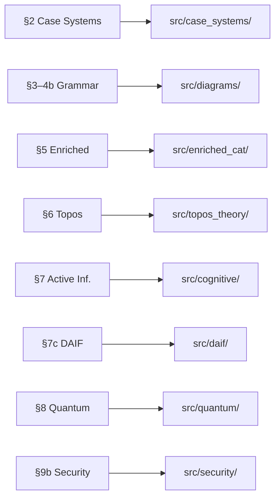

# Extension Guide

How to add new modules, figures, manuscript sections, and tests to *Cognitive Diagrams: Reviewing Categorical Accounts of Linguistic Case* ([`../manuscript/config.yaml`](../manuscript/config.yaml) `paper.title`).

> **Prerequisites**: Read [`architecture_overview.md`](architecture_overview.md) for the package dependency graph.  
> **Glossary**: See [`glossary.md`](glossary.md) for term definitions.

---

## Architecture Prerequisites

Before adding anything, understand the **manuscript-aligned package structure** (ADR-001). Each `src/` subpackage maps to a manuscript section:



### Package Dependency Rules

Imports must follow the DAG shown in [`architecture_overview.md`](architecture_overview.md):

| Package | May import from | Must NOT import from |
|---------|----------------|---------------------|
| `case_systems` | *(no internal deps)* | anything in `src/` |
| `diagrams` | `case_systems` | `cognitive`, `daif`, `quantum`, `security` |
| `enriched_cat` | `case_systems` | `diagrams`, `cognitive`, `quantum` |
| `topos_theory` | `case_systems`, `enriched_cat` | `diagrams`, `cognitive`, `daif`, `quantum`, `security` |
| `cognitive` | `case_systems`, `enriched_cat` | `diagrams`, `quantum`, `security` |
| `daif` | `cognitive`, `enriched_cat`, `case_systems` | `diagrams`, `quantum`, `security` |
| `quantum` | `case_systems` | anything else except `case_systems` |
| `security` | `case_systems`, `enriched_cat` | `cognitive`, `quantum`, `diagrams` |
| `visualization` | **all packages** | *(unrestricted)* |

> **Violating these rules breaks the architecture**. Check imports with: `grep -r "from src\." src/{your_package}/`

---

## Adding a New Source Module

### 1. Choose the Right Package

| Domain | Package | Example |
|--------|---------|---------| 
| Linguistic case / alignment | `src/case_systems/` | `src/case_systems/split_ergativity.py` |
| Category theory / diagrams | `src/diagrams/` | `src/diagrams/pregroup_normal_form.py` |
| Active inference / cognitive | `src/cognitive/` | `src/cognitive/epistemic_foraging.py` |
| Distributional AI / DAIF | `src/daif/` | `src/daif/risk_measures.py` |
| Enriched / magnitude | `src/enriched_cat/` | `src/enriched_cat/weighted_colimits.py` |
| Quantum / POVM | `src/quantum/` | `src/quantum/quantum_context.py` |
| Security / adversarial | `src/security/` | `src/security/adversarial_case_injection.py` |
| Topos / geometric | `src/topos_theory/` | `src/topos_theory/sheaves.py` |
| Visualization | `src/visualization/` | `src/visualization/my_plot.py` |

### 2. Module Template

```python
"""
Module: {name}
Purpose: {one-line description}
Section: {§N of manuscript}
Equation: {\\label{eq:...}} if implementing a specific equation
"""
import logging
from typing import ...

logger = logging.getLogger(__name__)

# All public constants should be UPPER_CASE and configurable via parameters
DEFAULT_PARAM: float = 1.0


def my_function(arg: type, *, param: float = DEFAULT_PARAM) -> type:
    """One-line docstring.

    Implements Eq. (N) from §M of the manuscript:
        <mathematical_formula>

    Args:
        arg: Description.
        param: Configurable parameter (default={DEFAULT_PARAM}).

    Returns:
        Description of return value.

    Raises:
        ValueError: If arg is invalid.
    """
    logger.debug("my_function called with arg=%s, param=%.3f", arg, param)
    # ...
    return result
```

### 3. Register in Package `__init__.py`

```python
# src/{package}/__init__.py
from .my_module import MyClass, my_function

__all__ = ["MyClass", "my_function"]
```

### 4. Register in Root `__init__.py` (if public API)

```python
# src/__init__.py
from .{package} import MyClass, my_function
```

### 5. Add AGENTS.md to the Package

Copy the existing AGENTS.md from a sibling package and update:
- Module map table
- Public API section
- Theory connection section

---

## Advanced Extension Patterns

### Adding a New Alignment System

To add split ergativity (where alignment varies by tense or animacy):

```python
# src/case_systems/split_ergativity.py
"""Split ergativity: alignment varies by context (§2)."""

from .case_category import CaseRole, CaseCategory
from .functor import AlignmentFunctor
from .fluid_s import FluidSFunctor

def split_ergative_alignment(
    animacy_threshold: float = 0.5,
) -> dict[str, AlignmentFunctor]:
    """Create split alignment: ergative for low-animacy, accusative for high.

    Returns:
        Dict with 'high_animacy' and 'low_animacy' alignment functors.
    """
    # High-animacy NPs use accusative alignment
    high = AlignmentFunctor(
        name="split-erg-high",
        object_map={CaseRole.S: CaseRole.NOM, CaseRole.A: CaseRole.NOM, CaseRole.P: CaseRole.ACC},
        ...
    )
    # Low-animacy NPs use ergative alignment
    low = AlignmentFunctor(
        name="split-erg-low",
        object_map={CaseRole.S: CaseRole.ABS, CaseRole.A: CaseRole.ERG, CaseRole.P: CaseRole.ABS},
        ...
    )
    return {"high_animacy": high, "low_animacy": low}
```

### Extending DisCoCirc Discourse

To add multi-turn dialogue circuits:

```python
# src/diagrams/dialogue_circuit.py
"""Multi-turn dialogue circuits via DisCoCirc (§4c extension)."""

from .string_diagram import Sentence, Discourse

class DialogueTurn:
    """A single dialogue turn with speaker and addressee roles."""
    speaker: str
    addressee: str
    sentence: Sentence

class Dialogue:
    """Multi-turn dialogue modelled as a DisCoCirc circuit."""
    turns: list[DialogueTurn]

    def to_circuit(self):
        """Build discourse circuit with speaker-addressee case role tracking."""
        ...
```

### Adding DAIF Risk Measures

To add a new risk distortion to the IQN framework:

```python
# src/daif/risk_measures.py
"""Additional risk distortion functions for IQN (§7c extension)."""

import numpy as np

def wang_distortion(tau: np.ndarray, eta: float) -> np.ndarray:
    """Wang transform: Φ(Φ⁻¹(τ) + η) for risk-adjusted quantiles.

    Args:
        tau: Quantile levels ∈ (0, 1).
        eta: Risk aversion parameter (η > 0 = risk-averse; η < 0 = risk-seeking).
    """
    from scipy.stats import norm
    return norm.cdf(norm.ppf(tau) + eta)
```

### Extending DAIF Inference Algorithms

To add a new inference algorithm (e.g., expectation propagation) to the DAIF framework:

```python
# src/daif/inference.py (extending existing module)
"""Add a new inference method to the DAIF inference module."""

import logging
import numpy as np
from .types import DAIFResult, DistributionalReturn
from .core import push_forward_return
from .metrics import convergence_diagnostics

logger = logging.getLogger(__name__)

def expectation_propagation_case_assignment(
    prior,  # CaseDiagramBelief
    observation_likelihoods: np.ndarray,
    transition_matrix: np.ndarray,
    *,
    n_iterations: int = 10,
    n_quantiles: int = 51,
    damping: float = 0.5,
    convergence_threshold: float = 1e-6,
) -> DAIFResult:
    """EP-based case assignment with distributional returns.

    Must follow ADR-009 (DAIF Convergence Protocol):
    1. Populate fe_trajectory at each iteration
    2. Return a complete DAIFResult with convergence diagnostics
    3. Risk distortion does NOT affect convergence criterion

    Args:
        prior: Prior belief over case roles.
        observation_likelihoods: P(observation | role).
        transition_matrix: Role-to-role transition probabilities.
        n_iterations: Maximum iterations.
        n_quantiles: Quantile resolution for return distributions.
        damping: EP damping factor ∈ (0, 1].
        convergence_threshold: Early stopping criterion.

    Returns:
        DAIFResult with belief, fe_trajectory, convergence, diagnostics.
    """
    fe_trajectory = []
    # ... EP logic with push_forward_return() ...

    # ADR-009: Must compute convergence diagnostics
    diag = convergence_diagnostics(fe_trajectory)
    logger.info("EP converged=%s after %d iterations", diag["converged"], diag["n_iterations"])

    return DAIFResult(
        belief=...,
        fe_trajectory=fe_trajectory,
        converged=diag["converged"],
        convergence_iteration=diag["n_iterations"],
        return_distribution=...,
        diagnostics=diag,
    )
```

### Extending Topological Pipelines

To introduce a new geometric or enriched layer (e.g., implementing Adjoint Functors between case topologies):

```python
# src/topos_theory/adjoint_functors.py
"""Adjoint functor implementations mapping case theories (§6 extension)."""

import numpy as np
from src.case_systems.functor import AlignmentFunctor
from src.enriched_cat.enriched import EnrichedCategory

class AdjointPair:
    """A pair of functors F ⊣ G defining an adjunction.
    
    Establishes the minimal required invariants for topological continuity:
    Hom_D(F(X), Y) ≅ Hom_C(X, G(Y))
    """
    left_adjoint: AlignmentFunctor
    right_adjoint: AlignmentFunctor

    def verify_adjunction(self, C: EnrichedCategory, D: EnrichedCategory) -> bool:
        """Verify the Hom-set bijection across the enriched matrix spectra.
        
        Evaluates the proximity matrix mappings numerically.
        """
        # ... logic asserting Trace(F * Z_C) == Trace(G * Z_D) within tolerance ...
```

### DAIF-Specific CI/CD Checklist

When adding or modifying any DAIF module, additionally verify:

1. **Convergence protocol** (ADR-009): New inference methods produce `fe_trajectory` and call `convergence_diagnostics()`
2. **Return distribution integrity**: All `DistributionalReturn` objects have valid quantiles (monotone increasing, finite values)
3. **Risk mode invariance**: Convergence criterion unaffected by `risk_distortion` setting
4. **Metrics consistency**: New metrics functions handle edge cases (empty distributions, single-point returns)
5. **ERP predictions**: If modifying `prediction.py`, verify N400/P600 amplitudes are in physiologically plausible ranges
6. **Visualization**: If adding new DAIF figures, register in `generate_diagrams.py` and `manuscript_figure_index.md`

```bash
# DAIF-specific test sweep:
uv run --project . --extra dev python -m pytest tests/test_daif*.py -v --cov=src/daif --cov-report=term-missing
```

### Adding a New Quantum POVM Type

To add an informationally complete POVM (SIC-POVM):

```python
# src/quantum/sic_povm.py
"""Symmetric informationally complete POVM (§8 extension)."""

from .quantum_case import CasePOVM, CaseRole
import numpy as np

def sic_case_povm(roles: list[CaseRole]) -> CasePOVM:
    """Create a SIC-POVM for case role measurement.

    SIC-POVMs provide the maximum information about the quantum state
    per measurement. For case roles, this means optimal case disambiguation.
    """
    d = len(roles)
    # Construct SIC-POVM elements from the Weyl-Heisenberg group
    ...
```

---

## Adding a New Figure

### 1. Add Render Function in `src/visualization/`

```python
# src/visualization/my_plots.py
"""Publication figures for {domain}."""
import matplotlib.pyplot as plt
from pathlib import Path
from .styles import FONT_SIZE_LABEL, FONT_SIZE_TITLE, FIGURE_DPI, FIGURE_SIZE_DEFAULT

def render_my_figure(
    data: MyData,
    output_path: Path | None = None,
    title: str = "My Figure",
) -> plt.Figure:
    """Render my figure. Returns matplotlib Figure.

    All fonts ≥ 16pt (ADR-003). Export at 150 DPI.
    """
    fig, ax = plt.subplots(figsize=FIGURE_SIZE_DEFAULT)
    ax.set_title(title, fontsize=FONT_SIZE_TITLE)
    # ... plot logic ...

    if output_path:
        fig.savefig(output_path, dpi=FIGURE_DPI, bbox_inches='tight')
    return fig
```

### 2. Visualization Standards Checklist

Before committing any figure:

- [ ] **Font floor**: All text ≥ 16pt (`FONT_SIZE_LABEL = 16`)
- [ ] **DPI**: Export at 150 DPI (`FIGURE_DPI = 150`)
- [ ] **Figure size**: Standard (10, 8) unless justified
- [ ] **Colorblind-safe**: Avoid red-green only distinctions
- [ ] **Caption**: Must exactly describe what is visually shown
- [ ] **Output path**: Saves to `output/figures/` via `generate_diagrams.py`
- [ ] **Test**: Add test in `tests/test_plot_modules.py` verifying file creation

### 3. Register in `generate_diagrams.py`

```python
# projects/cognitive_case_diagrams/scripts/generate_diagrams.py
from src.visualization.my_plots import render_my_figure

# In generate_all_diagrams():
render_my_figure(data, output_path=figures_dir / "my_figure.png")
```

### 4. Reference in Manuscript

Add a standard Markdown image in the target manuscript section: alt text in square brackets, a parenthesized path to the PNG (relative to the manuscript file, often under `output/figures/`), and a Pandoc id suffix `{#fig:stable-id}`. The combined PDF pipeline resolves figures from the project’s `output/figures/` tree; use the same path style as existing sections in `manuscript/*.md` (this guide omits a literal `` line so the docs tree does not reference a non-existent example PNG).

### 5. Add to `docs/manuscript_figure_index.md`

Add a row to the Figure Inventory table.

---

## Adding a New Manuscript Section

### 1. Create the File

```bash
# Files follow the naming pattern NN_section_name.md or NNb_subsection.md
touch projects/cognitive_case_diagrams/manuscript/10b_new_section.md
```

### 2. File Header Template

```markdown
# §10b New Section Title {#sec:new-section}

Brief overview paragraph.

## First Subsection

...
```

### 3. Register in `config.yaml`

```yaml
manuscript:
  chapters:
    - 00_abstract.md
    # ... existing chapters ...
    - 10b_new_section.md
    - 10_conclusion.md  # Always last (except notation appendices)
```

### 4. Notation Check

Before introducing a new symbol, check [`11b_notation.md`](../manuscript/11b_notation.md) (App B) for existing conventions. If adding a new symbol:
1. Add it to the appropriate section (A–K) in `11b_notation.md`
2. Use consistent notation in all equations

### 5. Add Section to Manuscript `AGENTS.md`

Add a row to the Chapter Map table in `manuscript/AGENTS.md`.

---

## Adding Tests

All tests follow the **no-mocks** policy — use real data and real computations.

### Test File Template

```python
"""Tests for {module}. No mocks — all tests use real data."""
import pytest
import numpy as np
from src.{package}.{module} import MyClass, my_function


class TestMyFunction:
    """Tests for my_function()."""

    def test_basic_case(self) -> None:
        """Test basic expected behavior."""
        result = my_function(valid_arg)
        assert result.some_property == expected_value

    def test_mathematical_property(self) -> None:
        """Test mathematical invariant (e.g., symmetry, positivity)."""
        result = my_function(arg)
        assert result >= 0, "Result must be non-negative"

    def test_edge_case(self) -> None:
        """Test edge case behavior."""
        result = my_function(edge_arg)
        assert isinstance(result, ExpectedType)

    def test_invalid_raises(self) -> None:
        """Test that invalid input raises ValueError."""
        with pytest.raises(ValueError, match="expected error text"):
            my_function(invalid_arg)

    def test_output_file(self, tmp_path: Path) -> None:
        """Test output file is created and non-empty."""
        out = tmp_path / "output.png"
        my_function(arg, output_path=out)
        assert out.exists()
        assert out.stat().st_size > 0
```

### Coverage Requirements

- `src/` coverage threshold: **90%** (set in `pyproject.toml`)
- Add `# pragma: no cover` only for truly unreachable runtime safety guards
- Check current line coverage: `uv run pytest tests/ --cov=src --cov-report=term` (from `projects/cognitive_case_diagrams/`)

```toml
# pyproject.toml
[tool.coverage.report]
fail_under = 90
```

### Running Tests

```bash
# All tests with coverage
uv run --project . --extra dev python -m pytest tests/ --cov=src --cov-report=term-missing -v

# Single test file
uv run --project . --extra dev python -m pytest tests/test_enriched_cat_enriched.py -v

# Quick smoke test
uv run --project . --extra dev python -m pytest tests/ -x -q
```

---

## CI/CD Integration Checklist

When adding any new module, figure, or section, ensure:

1. **Tests pass**: `pytest tests/ --cov=src` → ≥90% coverage
2. **No new imports violate DAG**: Check `grep -r "from src\." src/{pkg}/`
3. **AGENTS.md updated**: Module table, API section, theory connection
4. **README.md updated**: Quick reference table
5. **Figures render**: `python scripts/generate_diagrams.py` completes without error
6. **Markdown validates**: `python -m infrastructure.validation.cli markdown manuscript/`
7. **PDF renders**: `python scripts/03_render_pdf.py --project cognitive_case_diagrams`

---

*Last updated: 2026-04-22. For full API signatures, see [`api_reference.md`](api_reference.md).*
